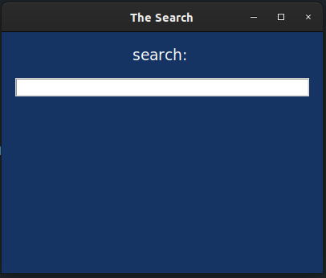
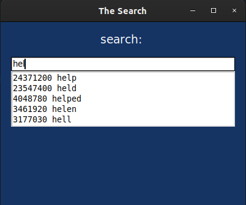
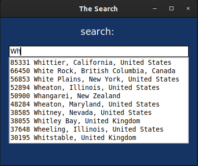

# Textsearch with autocomplete function
Textsearch is a small program with an UI, build with **tkinter**. It provides a autocomplete function, based on the prefix that you entered. 

### default user interface:


## Getting started
To run the program, enter following command:

```
python3 textSearch.py *dataset* *k-rows*
```
The program gets two inputs:
1. First, the name for the dataset, which constisting of two rows (weights, name). In this repository, you can find two datasets **wiktionary.txt** and **cities.txt**. 
2. Next input is the max output of results, that this program should be displaying (k-rows)

The ui will be shown and you can start to enter any string into the command line.

### textsearch with a wiktionary.txt-dataset and max 5 rows as output


### textsearch with a cities.txt-dataset and max 10 rows as output


## Logic
textsearch takes the given prefix from the ui and searching with an adjusted **binarysearch-function** in the dataset. Based on the weights, **autocomplete.py** returns a descending ordered list with k-results for the prefix and displaying this in the ui. The sorting is based on weights, which present a probability. 